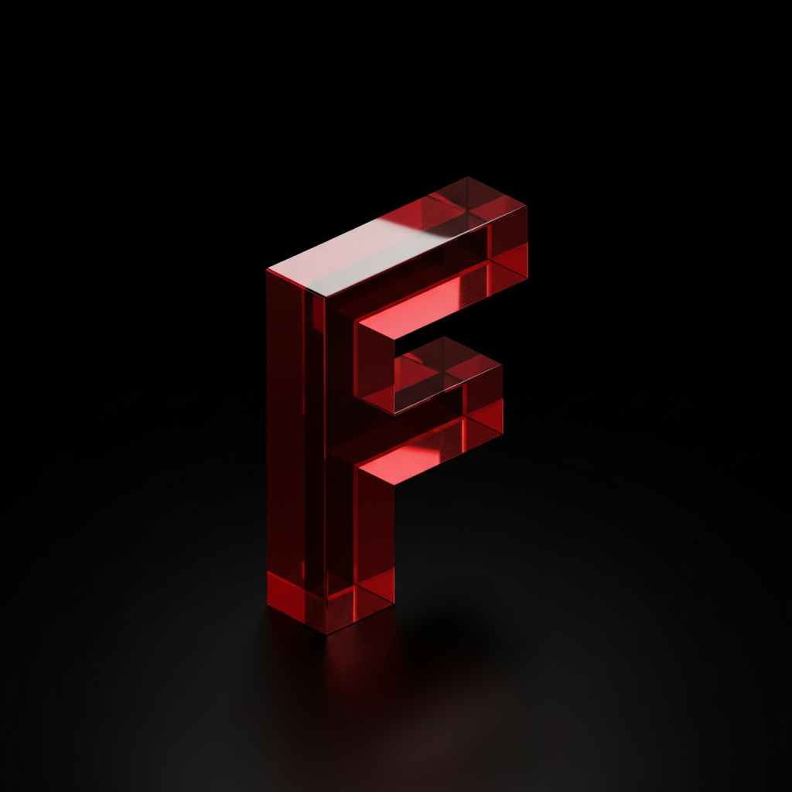
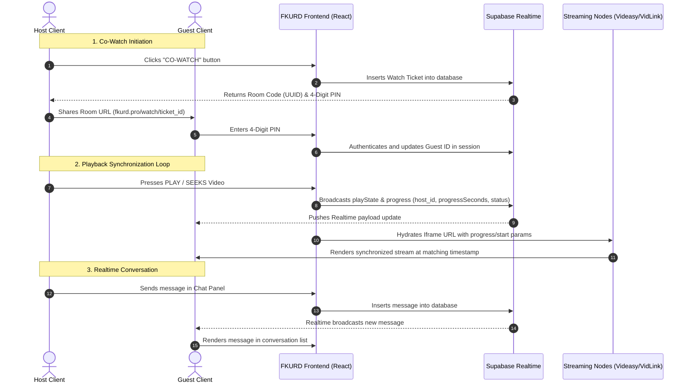

  
  
  # 🎬 FKURD MOVIES (`fkurd.pro`)
  
  
  
  
  
  

---

# 🔗 بەشی کوردی (Kurdish Section)

## 🌟 ناساندن و تەلارسازی پڕۆژە
**ئێف کورد مووڤیس (FKURD MOVIES)** ئەپڵیکەیشنێکی سینەمایی پێشکەوتووی تایبەت و پارێزراوە، کە بۆ پەخشکردنی فیلم و زنجیرە ژێرنووس و دۆبلاژکراوە کوردییەکان لەسەر وێب، مۆبایل (ئایفۆن و ئەندرۆید) و دێسکتۆپ بە شێوەیەکی نایاب و بەرزترین کوالێتی تەلارسازی کراوە. 

ئەم پڕۆژەیە بە تەواوی لەلایەن **زانا فارۆق** دیزاین، تەلارسازی و ئەندازیاری کراوە وەک داهێنانێکی نوێ لە بواری سینەمای کوردی. پڕۆژەکە خاوەنی کۆدێکی داخراو و تایبەتە و مۆڵەتی کۆپیکردن یان بڵاوکردنەوەی بە هیچ شێوەیەک پێنەدراوە.

---

## ✨ تایبەتمەندییە ناوازە و گشتگیرەکان

### 🖥️ ١. ڕووکاری فرە-ئامێری نیشتمانی (Multi-Device Native Shells)
*   **بزوێنەری وێبکلیپی ڕەسەنی ئایفۆن (iOS WebClip)**: سیستمەکە توانای دروستکردن و دابەزاندنی پرۆفایلی ڕەسەنی ئەپڵی هەیە (`.mobileconfig`). بەمەش مۆبایلەکانی ئایفۆن دەتوانن ئەپەکە بە شێوازی کارپێکردنی ڕەسەنی بێ ناونیشانی وێبگەڕ (Full-Screen Safari Overlay) لەسەر شاشەی سەرەکی جێگیر بکەن.
*   **ئەپی دێسکتۆپی ڕەسەن (Tauri Desktop Shell)**: بە تەواوی ئامادەیە بۆ کارپێکردن لەسەر کۆمپیوتەر (ماک و ویندۆز) بە کەمترین قەبارە و خێراترین کات، خاوەن دوگمەکانی کۆنترۆڵی دێسکتۆپ و شوێنی ڕاکێشانی تایبەت (Custom Drag Regions).
*   **سیستەمی گەڕانی کۆنسۆڵ (Spatial Navigation Engine)**: دیزاین کراوە بۆ کارکردن لەگەڵ کیبۆرد، گەیمپاد (Gamepad) و کۆنترۆڵە زیرەکەکان (TV Remote Controls) کە بە شێوازێکی زۆر خێرا فۆکس دەخاتە سەر بەشەکان لەگەڵ دەورەدانی ڕووناکی داینامیکی.

### 🔄 ٢. ژووری بینینی هاوبەشی ڕاستەوخۆ (Real-Time Co-Watching)
*   **هاوکاتکردنی پەخش لە کاتی ڕاستەقینەدا**: کارپێکردن، وەستاندن، گەڕاندنەوە یان پێشخستنی کاتی فیلمەکان بە شێوەی خۆکار لە نێوان خانەخوێ (Host) و میوانەکاندا هاوکات دەکرێت لە ڕێگەی کەناڵە خێراکانی Supabase Realtime.
*   **چوونەژوورەوەی بێ ئەکاونت**: میوانەکان دەتوانن تەنها بە داخڵکردنی کۆدی PINی ٤ ژمارەیی کە لەلایەن خانەخوێوە دروست دەکرێت بچنە ژوورەکەوە بێ پێویستی بە دروستکردنی هیچ ئەکاونتێک.
*   **سیستەمی چاتی ڕاستەوخۆ (Room Chat)**: پانێڵی چاتکردنی ناوەکی لە کاتی بینینی فیلمەکەدا بۆ ئاڵوگۆڕکردنی نامەکان لە کاتی ڕاستەقینەدا.

### 📱 ٣. شۆرتس و چیرۆکەکان (Shorts & Story Reels)
*   **پەڕەی شۆرتسی سینەمایی (Shorts Page)**: ڕێگە بە بەکارهێنەران دەدات لە ڕێگەی گەڕانی ستوونی (Vertical Swiping) هاوشێوەی تیکتۆک و یوتیوب ترەیلەر و کورتە ڤیدیۆکانی فیلمەکان بە کوالێتی بەرز ببینن.
*   **چیرۆکەکانی بەشی سەرەوە (Story Reels)**: لە لاپەڕەی سەرەکی، شریتی چیرۆکە بازنەییەکان هاوشێوەی ئینستاگرام نیشان دەدرێن بۆ ئاگاداربوون لە نوێترین کورتە ترەیلەر یان ڕیکلامی فیلمە تازەکان.

### 🛡️ ٤. ڕێبەری بلۆککردنی ڕیکلامەکان (AdGuard Integration)
*   **چالاککردنی بێ ڕیکلام (Ad-Block Onboarding)**: سیستمەکە خاوەن مۆدیۆلێکی فێرکاری کارپێکەرە کە یارمەتی بەکارهێنەر دەدات پرۆفایلی تایبەتی DNSی ئەدگارد (`adguard-dns.mobileconfig`) دابەزێنێت بۆ سەر مۆبایلەکەی بە مەبەستی پاککردنەوەی فیلمەکان لە هەموو جۆرە ڕیکلامێکی دەرەکی بێزارکەر.

### 🎨 ٥. مەکینەی شێواز و دیزاینی پێشکەوتوو (Neural Theme Engine)
*   **شێوازی ڕەنگەکان (Accent Color)**: کارپێکەر دەتوانێت ڕەنگی سەرەکی ئەپەکە بە ئارەزووی خۆی بگۆڕێت.
*   **مۆدی ڕووناکی و تاریکی (Dark & Light Mode)**.
*   **قەبارەی ڕووکار (Scale & Density Ratio)**: ڕێگە بە کارپێکەر دەدات ڕێژەی چڕی و قەبارەی دەق و دوگمەکانی ئەپەکە لە نێوان 40% بۆ 150% بگۆڕێت بە بەکارهێنانی مۆدی فلتەری تایبەت.

### 🎥 ٦. مێژووی تەماشاکردن (Continue Watching)
*   سیستمەکە بە تەواوی خاڵی وەستانی ڤیدیۆکان لە بیرگەی ناوخۆیدا پاشەکەوت دەکات، بە شێوەیەک بەکارهێنەر هەر کاتێک بگەڕێتەوە دەتوانێت لە هەمان چرکەوە بەردەوام بێت لە بینینی فیلمەکە.

---

# 🔗 English Section

## 🌟 Project Concept & Engineering
**FKURD MOVIES** is an ultra-premium, proprietary cinema streaming framework engineered specifically to broadcast Kurdish dubbed and subtitled media. Conceptualized, designed, and constructed by **Zana Faroq**, this application bridges the gap between web applications and native hardware performance. It features native wrappers for Apple iOS WebClips, Tauri Desktop engines, and Supabase database synchronization.

This repository holds closed-source, proprietary code. Public redistribution, copying, or unauthorized hosting is strictly prohibited.

---

## ✨ Comprehensive Feature Breakdown

### 🖥️ 1. Hardware-Optimized Shells
*   **iOS Config Profile Engine (`.mobileconfig`)**: Generates and serves signed Apple configuration profiles. When downloaded, iOS devices mount the application as a standalone WebClip, stripping away Safari address bars, status overlays, and navigation constraints to run in absolute full-screen mode.
*   **Tauri Desktop Runtime**: Custom desktop application integration using Tauri v2. Written with a high-performance Rust core, it includes customized draggable window frames, custom top title bars, system tray handlers, and memory-safe hardware acceleration.
*   **Spatial Navigation Engine**: Features a console-grade directional navigation framework. Users can navigate every tab, grid, and button using keyboard arrow keys, gamepads, or smart TV remotes, enhanced by layout focus rings.

### 🔄 2. Real-Time Watch Parties (Co-Watch)
*   **Supabase Realtime Sync Loop**: Host commands (play, pause, seek, load subtitle) broadcast instantly over Supabase Realtime Channels. Guest players listen to these events and synchronize their iframe video players within milliseconds.
*   **Anonymous Guest Node**: A ticket-based PIN authorization mechanism. Guests join active rooms securely using a generated 4-digit PIN, eliminating the friction of account creation.
*   **Integrated Room Chat**: A sliding sidebar chat panel linked to real-time message tables, featuring message styling, time-stamping, and notification badges.

### 📱 3. Cinematic Stories & Swipable Shorts
*   **Vertical Shorts Feed**: A custom-built mobile-first vertical scrolling page. Users swipe through movie trailers and promotional teasers styled like modern short-form video platforms.
*   **Interactive Story Reels**: Displays circular story widgets at the top of the homepage (similar to Instagram). Tapping these reels opens interactive trailer cards.

### 🛡️ 4. Ad-Blocking System (AdGuard Integration)
*   **Ad-Blocker Profile Deployment**: To bypass third-party advertisement injections on video players, the application hosts a custom onboarding flow. This flow directly serves an AdGuard DNS profile (`/adguard-dns.mobileconfig`) to configure ad-blocking globally at the operating system level.

### 🎨 5. Neural Theme Engine & Interface Density
*   **Global Palette Selection**: Users can hot-swap the primary accent color of the entire application layout.
*   **Density Scaling Slider**: Features a custom-engineered UI scale controller. Users adjust the entire application interface density between 40% (high density cinematic layout) and 150% (accessible large-font layout) with instant viewport synchronization.
*   **Automatic FPS Counter**: A built-in hardware performance monitoring card rendering live frames per second to track hardware-acceleration status.

### 🎥 6. Session Resume Portal (Continue Watching)
*   Tracks user viewing progress in real-time. If a user closes a movie, a portal appears on the homepage displaying the resume timestamp and progress bar, letting them continue watching with a single tap.

---

## 📊 System Architecture & Data Flow

---

## 🛠️ Technology Stack & Dependencies

*   **Frontend Library**: React 19 (Strict Mode active)
*   **Routing Controller**: React Router DOM v7 (HTML5 View Transitions API enabled for fluid page changes)
*   **UI/UX Framework**: Tailwind CSS & Vanilla CSS design variables
*   **Animation System**: Framer Motion & CSS hardware-accelerated composite keyframes
*   **Desktop Engine**: Tauri v2 (Rust-backend shell)
*   **Database Realtime**: Supabase (Postgres real-time publication filters)
*   **Metadata Integration**: Standard metadata catalogs for Kurdish dubs and subtitle translations.

---

## 📄 Legal & Licensing / بەشی یاسایی و مۆڵەتنامەکان

This software is governed by standard proprietary agreements and specific licensing modules:
*   [MIT License](LICENSE) (MIT Standard core license)
*   [Apache 2.0 License](LICENSE-APACHE) (For external API/Tauri modules)
*   [Fair Use Policy](FAIRUSE.md) (Compliance under Section 107 analysis)
*   [DMCA Takedown Policy](DMCA.md) (DMCA copyright procedures)

Copyright (c) 2026 Zana Faroq. All rights reserved.
