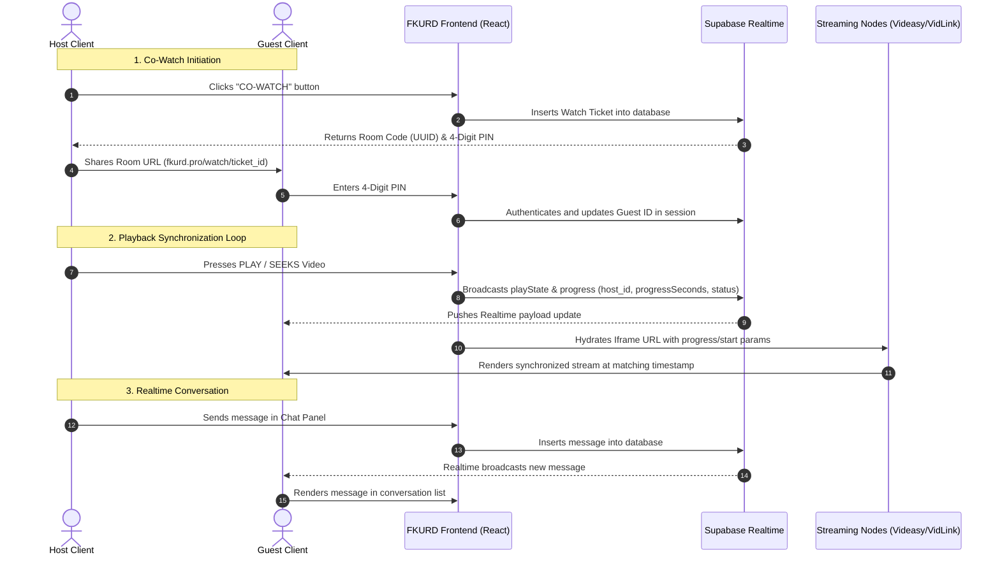

  
  
  # 🎬 FKURD MOVIES (`fkurd.pro`)
  
  
  
  
  
  

  **FKURD MOVIES** is a proprietary, hardware-optimized synchronized cinema application designed to stream Kurdish dubbed and subtitled media. Leveraging state-of-the-art web performance patterns, it delivers a native-like cinema experience across desktop, mobile platforms, and Tauri-based desktop shells.

---

## 🔒 Proprietary Application Overview

This repository contains the source code for the private deployment of **FKURD MOVIES**. It is hosted and distributed under strict licensing, and is not open for public modification, cloning, or redistribution.

### 🖥️ 1. Multi-Device Native Shells
*   **iOS Config Profile Engine**: Generates and packages Apple configuration profiles (`.mobileconfig`) on-the-fly, allowing mobile users to install the application as a standalone, native-behaving iOS web clip.
*   **Tauri Desktop Shell**: Native integration with the Tauri runtime for desktop distribution, featuring custom drag regions, custom windows controls, and full-screen hardware-accelerated presentation modes.
*   **Spatial Navigation Engine**: Console-style focus navigation mapping standard keyboard arrow keys, gamepads, and remote controls with an animated focus glow.

### 🔄 2. Synchronized Co-Watching
*   **Real-Time Playback Synchronization**: Automatic syncing of play, pause, and seek events. Host commands are broadcasted to guest clients over Supabase Realtime Channels.
*   **No-Auth Guest Access**: Anonymous guest users join rooms securely using 4-digit PIN codes generated dynamically for each session.
*   **Chat Subsystem**: Dynamic room conversation list driven by real-time publications.

### 🌐 3. Multi-Server Smart Routing
*   **Dynamic Priority Balancing**: Evaluates and routes media streams through ranked server priorities (e.g. `Videasy` / `FKURD SERVER 1`, `VidLink Pro` / `FKURD SERVER 2`, `SuperEmbed`).
*   **Autoplay & Custom Subtitle Injection**: Automated discovery and loading of custom Kurdish subtitles with full query parameters passed to compliant media players.

---

## 📊 System Architecture & Data Flow

Below is the architectural flow diagram showing how **FKURD MOVIES** coordinates media streaming, client routing, and Supabase real-time synchronization:

---

## 🛠️ Technology Stack

*   **Frontend Engine**: React 19 (StrictMode)
*   **Router Control**: React Router DOM v7 (View Transitions API enabled)
*   **Layout & Styling**: Tailwind CSS & Vanilla CSS Design Tokens
*   **Animations**: Framer Motion & CSS hardware-accelerated keyframe composite layers
*   **Desktop Shell**: Tauri v2
*   **Database & Real-Time Sync**: Supabase (PostgreSQL + Realtime Publications)
*   **AI Integration**: Powered by Google AI Studio (Gemini Pro models) for underlying catalog metadata enrichment and language translation processing.

---

## 📄 License & Terms of Use

All rights reserved. The source code, assets, configurations, and documentation within this project are proprietary property. Authorized access only.
