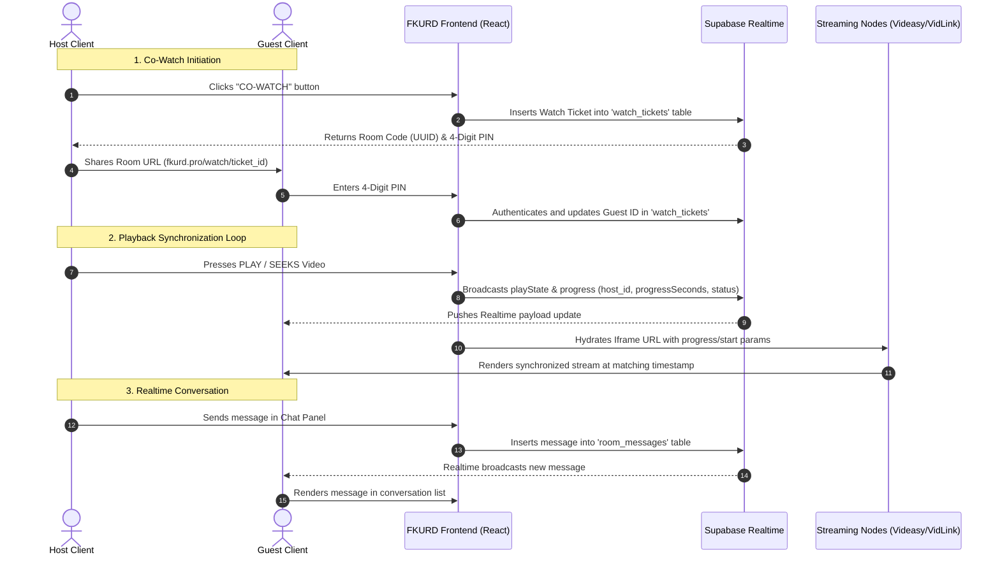

<div align="center">
  
  
  # 🎬 FKURD MOVIES (`fkurd.pro`)
  
  [](https://fkurd.pro)
  [](#)
  [](#)
  [](#)
  [](#)

  **FKURD MOVIES** is a state-of-the-art, hardware-optimized, synchronized cinema web application custom-built for streaming Kurdish dubbed and subtitled content natively across desktop, mobile (iOS profiles), and Tauri-based desktop environments.
</div>

---

## 🌟 Core System Features

### 🖥️ 1. Multi-Device Native Integration
*   **iOS Config Profile Generator**: Generates and downloads native Apple configuration profiles (`.mobileconfig`) for full-screen web clip cinema shortcuts.
*   **Tauri Desktop Shell Ready**: Built-in support for Tauri desktop runtimes, including custom title bars, window drag regions, and native system dialog protocols.
*   **Spatial Navigation Engine**: Console-style navigation mapping keyboard arrow keys, gamepads, and remote controls with an animated focus glow.

### 🔄 2. Real-Time Co-Watching
*   **Host-Driven Synchronization**: Synchronized playback (play, pause, seek) with automatic progress updates broadcasted over Supabase Realtime Channels.
*   **No-Auth Guest Access**: Anonymous guests can join rooms using secure 4-digit PIN access codes without requiring account creation.
*   **Realtime Room Chat**: Dynamic messaging subsystem running over PostgreSQL triggers for room chat during streaming.

### 🌐 3. Multi-Server Smart Routing
*   **Automatic Server Priority**: Dynamically evaluates and connects users to the highest priority server available (e.g. `Videasy`, `VidLink Pro`, `SuperEmbed`).
*   **Admin Priority Dashboard**: Admins can drag/reorder server priority weights inside the management panel, saving rankings globally.
*   **Autoplay & Custom Subtitle Injection**: Videasy (`FKURD SERVER 1`) is configured with native autoplay and mounts automated Kurdish subtitles dynamically on player load.

---

## 📊 System Architecture & Data Flow

Below is the diagram showing how **FKURD MOVIES** coordinates media streaming, client routing, and Supabase real-time synchronization:



---

## 🛠️ Technology Stack

*   **Frontend Library**: React 19 (StrictMode)
*   **Route Controller**: React Router DOM v7 (View Transitions API enabled)
*   **Layout & Styling**: Tailwind CSS & Custom Glassmorphic CSS Engine
*   **Animations**: Framer Motion & CSS keyframe composite layers
*   **Desktop App Engine**: Tauri v2
*   **Database & Sync**: Supabase (PostgreSQL + Realtime Publications)
*   **Static Assets & Sitemap**: Dynamic sitemap generation linking over 500 catalog items

---

## 🗄️ Database Schemas (Supabase SQL Setup)

Execute the following migrations in your Supabase SQL Editor to support the application database backend:

### 1. Synchronized Co-Watching & Ticketing Schema (`watch_tickets` & `room_messages`)
```sql
-- Create Watch Tickets Table
CREATE TABLE IF NOT EXISTS watch_tickets (
    id UUID PRIMARY KEY DEFAULT gen_random_uuid(),
    movie_id TEXT NOT NULL,
    host_id UUID NOT NULL,
    guest_id UUID,
    pin_code VARCHAR(4) NOT NULL,
    status TEXT NOT NULL DEFAULT 'waiting' CHECK (status IN ('waiting', 'active', 'finished')),
    created_at TIMESTAMPTZ NOT NULL DEFAULT NOW()
);

-- Create Room Messages Table
CREATE TABLE IF NOT EXISTS room_messages (
    id UUID PRIMARY KEY DEFAULT gen_random_uuid(),
    ticket_id UUID NOT NULL REFERENCES watch_tickets(id) ON DELETE CASCADE,
    user_id UUID NOT NULL,
    message TEXT NOT NULL,
    created_at TIMESTAMPTZ NOT NULL DEFAULT NOW()
);

-- Enable RLS & Configure Public RLS Policies
ALTER TABLE watch_tickets ENABLE ROW LEVEL SECURITY;
CREATE POLICY "Allow anonymous read/write access to watch_tickets" 
ON watch_tickets FOR ALL TO anon, authenticated USING (true) WITH CHECK (true);

ALTER TABLE room_messages ENABLE ROW LEVEL SECURITY;
CREATE POLICY "Allow anonymous read/write access to room_messages" 
ON room_messages FOR ALL TO anon, authenticated USING (true) WITH CHECK (true);

-- Enable Supabase Realtime for Broadcast Channels
BEGIN;
  ALTER PUBLICATION supabase_realtime DROP TABLE IF EXISTS watch_tickets, room_messages;
  ALTER PUBLICATION supabase_realtime ADD TABLE watch_tickets;
  ALTER PUBLICATION supabase_realtime ADD TABLE room_messages;
COMMIT;
```

### 2. Exclusive Dubbed Movies Registry (`dubbed_movies`)
```sql
CREATE TABLE IF NOT EXISTS public.dubbed_movies (
    id BIGSERIAL PRIMARY KEY,
    title VARCHAR(255) NOT NULL,
    description TEXT NOT NULL,
    imageBase64 TEXT NOT NULL,
    bannerBase64 TEXT NULL,
    videoUrl TEXT NOT NULL,
    level VARCHAR(50) DEFAULT 'KING',
    created_at TIMESTAMPTZ NOT NULL DEFAULT NOW()
);

-- Enable RLS and establish Read & Insert Permissions
ALTER TABLE public.dubbed_movies ENABLE ROW LEVEL SECURITY;
CREATE POLICY "Allow public read access" ON public.dubbed_movies FOR SELECT USING (true);
CREATE POLICY "Allow public insert access" ON public.dubbed_movies FOR INSERT WITH CHECK (true);
```

### 3. Custom Kurdish Subtitles Storage (`custom_subtitles`)
```sql
CREATE TABLE IF NOT EXISTS public.custom_subtitles (
    id BIGSERIAL PRIMARY KEY,
    tmdb_id VARCHAR(255) NOT NULL,
    media_type VARCHAR(50) NOT NULL CHECK (media_type IN ('movie', 'tv')),
    language VARCHAR(10) NOT NULL DEFAULT 'ku',
    subtitle_url TEXT NOT NULL,
    season INT DEFAULT 0,
    episode INT DEFAULT 0,
    created_at TIMESTAMPTZ NOT NULL DEFAULT NOW()
);

-- Enable RLS and establish Read & Insert Policies
ALTER TABLE public.custom_subtitles ENABLE ROW LEVEL SECURITY;
CREATE POLICY "Allow public read access" ON public.custom_subtitles FOR SELECT USING (true);
CREATE POLICY "Allow public insert access" ON public.custom_subtitles FOR INSERT WITH CHECK (true);
```

---

## 🚀 Local Development Setup

### ⚙️ Prerequisites
Ensure you have **Node.js (v18+)** installed.

### 📦 Installation
1.  Clone the repository:
    ```bash
    git clone https://github.com/FLKRDAIv1/flkrd-movies-react.git
    cd flkrd-movies-react
    ```
2.  Install required packages:
    ```bash
    npm install
    ```
3.  Configure your local environment variables in `.env.local`:
    ```env
    VITE_SUPABASE_URL=your-supabase-url
    VITE_SUPABASE_ANON_KEY=your-supabase-anon-key
    VITE_TMDB_API_KEY=your-tmdb-api-key
    ```
4.  Launch the development server:
    ```bash
    npm run dev
    ```
5.  Build the production bundle and compile the sitemap:
    ```bash
    npm run build
    ```

---

## 📄 Licensing & Documentation

*   **Production Deployment**: Hosted on Vercel and available globally at [https://fkurd.pro](https://fkurd.pro).
*   **GitHub Repository**: [https://github.com/FLKRDAIv1/flkrd-movies-react](https://github.com/FLKRDAIv1/flkrd-movies-react).
